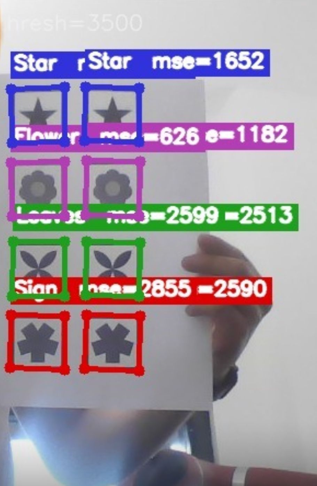
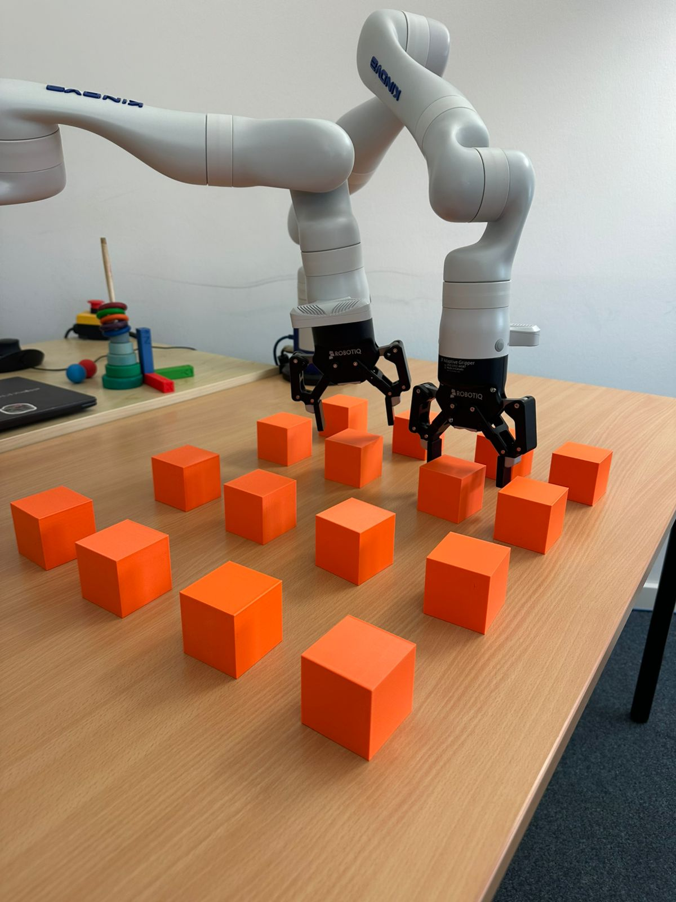
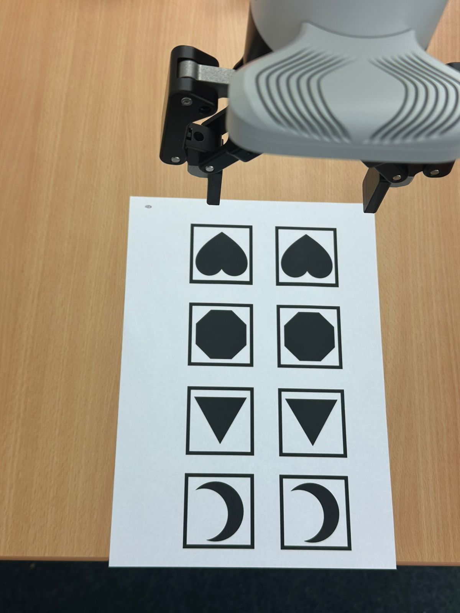
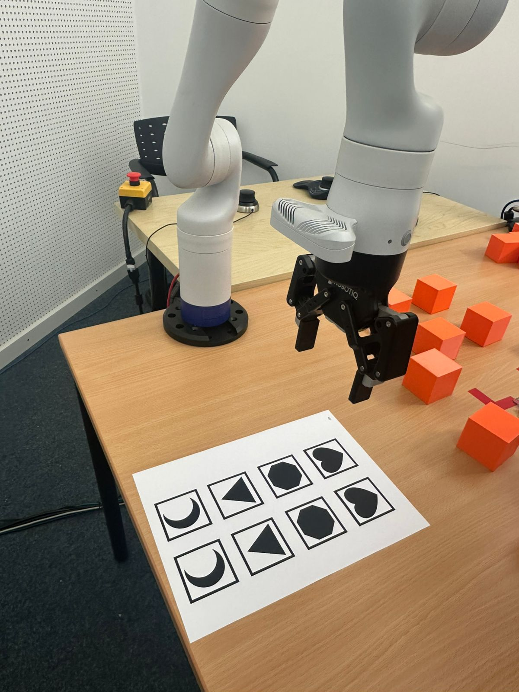

# Real-Time Card Detector — Kinova Robot Vision

This repository contains the vision module I built for a robotic Memorama game using a Kinova dual-arm robot. The detector runs on the wrist camera feed and identifies which card shape is visible in real time.

---

## What This Does

In the Memorama setup, cards are glued to the bottom of physical boxes placed on a table. During the robot's turn, it uses both arms to simultaneously pick up two boxes. Each wrist camera then looks at the card attached to the box held by the opposite arm, so the left camera sees the card held by the right arm and vice versa.

The detector then:
- Finds card-shaped quadrilateral regions in the image
- Warps them into a normalized top-down view
- Compares them against stored templates across all orientations
- Returns the best match with its confidence score

The detected card types are: Flower, Heart, Leaves, Moon, Octagon, Sign, Star, Triangle.

---

## Demo

Detector running with live detections and MSE scores:



Kinova dual-arm setup with the boxes on the table:



Cards as seen from the robot wrist camera:



Kinova robot arm during testing with the card sheet on the table:



---

## How It Works

I kept the pipeline classical and lightweight because the set of shapes is small and fixed, so using a learned model felt unnecessary for this project. Here is how each frame gets processed:

1. The frame is converted to grayscale and smoothed with a Gaussian blur to reduce noise before thresholding.
2. Adaptive thresholding is applied (inverted) so that card edges appear as bright contours. I used adaptive instead of a fixed threshold because the wrist camera lighting changed a lot depending on arm position.
3. Contours are extracted and filtered. Only contours that approximate a 4-point polygon and meet a minimum area are kept as card candidates.
4. Each candidate quad is perspective-warped into a normalized 200x200 top-down view and binarized using Otsu's method.
5. The warped card image is compared against all 8 templates. To handle different orientations, I also compare each template at 0°, 90°, 180° and 270° using MSE. This made the detector much more reliable without adding much complexity.
6. The template with the lowest MSE is chosen. If the score is above MAX_MSE_THRESHOLD = 3500 the detection is rejected to avoid false positives.
7. A centroid distance check using Euclidean distance suppresses duplicate detections of the same card.

---

## Project Structure

```
card-detector-kinova-robot/
├── card_detector.py          # Main detection logic and webcam demo
├── card_detector_node.py     # ROS node, subscribes to Kinova wrist camera
├── requirements.txt          # Python dependencies
├── data/
│   └── templates/            # Binary silhouette templates for each card type
│       ├── flower.png
│       ├── heart.png
│       ├── leaves.png
│       ├── moon.png
│       ├── octagon.png
│       ├── sign.png
│       ├── star.png
│       └── triangle.png
└── media/                    # Demo images and setup photos
     ├── detector_output.jpeg
     ├── robot_setup.jpeg
     ├── robot_view.jpeg
     └── wrist_camera_view.jpeg
```

---

## Usage

### Webcam Demo (no robot needed)

I used this mode first to tune the thresholds before testing on the actual robot camera.

```bash
python card_detector.py --camera 0
```

| Key | Action |
|-----|--------|
| `q` | Quit |
| `s` | Save snapshot |
| `d` | Debug warp window |

Add `--debug` to show the warped ROI for each detection:
```bash
python card_detector.py --camera 0 --debug
```

### ROS Node (using Kinova robot)

ROS should be running and the Kinova camera topic must be active, then:
```bash
python card_detector_node.py
```

Right now the node subscribes to `/right/camera/color/image_raw`, which is the right wrist camera in our dual-arm setup. If needed, this can be changed directly at the bottom of `card_detector_node.py` depending on which arm camera is used or the specific Kinova configuration available.

---

## Configuration

In practice, `MAX_MSE_THRESHOLD`, `MIN_QUAD_AREA` and `ADAPTIVE_BLOCK_SIZE` were the main parameters I adjusted during testing. The others I mostly left at their defaults.

| Parameter | Default | Description |
|-----------|---------|-------------|
| `TEMPLATE_SIZE` | 200 | Size (px) of normalized card ROI |
| `MAX_MSE_THRESHOLD` | 3500 | Maximum MSE to accept a detection |
| `MIN_QUAD_AREA` | 2000 | Minimum contour area to consider |
| `BORDER_MARGIN` | 15 | Pixels to crop from card edge after warp |
| `ADAPTIVE_BLOCK_SIZE` | 31 | Block size for adaptive thresholding |

---

## Current Limitations

- Works best when the card contour is clearly visible and not heavily occluded
- The MSE threshold may need tuning depending on lighting conditions or camera exposure
- The templates are binary silhouettes designed for the specific cards used in our Memorama setup, so they don't generalize to other card designs (new template images are needed)
- Currently only tested with the Kinova wrist camera and a regular webcam

---

## Technologies

- Python 3
- OpenCV for image processing, contour detection and perspective transforms
- NumPy for array operations and MSE computation
- ROS for camera topic subscription and integration with the robot
- Kinova Gen3 dual-arm platform

---

## Context

I originally built this as a personal project to practice real-time shape detection using classical computer vision. Later I adapted it for our Robotic Memorama project at Constructor University, where it became the vision component of the full game pipeline.

The full system also includes robot manipulation for picking and placing the box covers, game state tracking to remember which cards have been seen and where, and the logic for deciding which positions to uncover next. This repository only contains the vision side.

---

## Author

Leonel Valdez — [github.com/leonelvaldez](https://github.com/leonelvaldez)